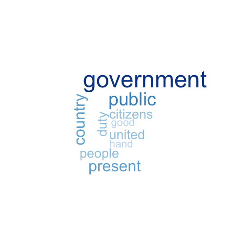

How do US Presidential Address differ ? 
========================================================
author: JRB
date: July 16th 2017
autosize: true

Motivation
========================================================

The idea for this shiny app was drawn from a news paper article that depicted wordclouds for President Obama and President Trump inaugural addresses. I wanted to build a application that would allow to compare inaugural addresses side by side for any president inaugurated since George Washington.  

This was also an opportunity to explore R NLP (Natural Language Processing) capabilities.

The inspiration for this work can be found [here](https://www.theguardian.com/world/gallery/2009/jan/21/obama-inauguration-word-clouds-gallery)

Finding Inaugural Addresses
========================================================

 We easily found that the package ```quanteda``` had the data we needed. Namely, the complete text of all inaugural addresses indexed by year and president.

```r
library(quanteda)
AllInaugs <- quanteda::data_corpus_inaugural
```
Here are the first 100 words of George Washington's address in 1793:  

```
[1] "Fellow-Citizens of the Senate and of the House of Representatives:\n\nAmong the vicissitudes incident "
```

Now we have the texts we were looking for indexed by president and year... Let's see how we can create wordclouds.

What are clouds made of ?
========================================================
*Tag clouds are visual presentations of a set of words, typically a set of tags, in which attributes of the text such as size, weight or colour can be used to represent features (e.g., frequency) of the associated terms.*^1  

Let's do this: calculate the frequency of words in the 1793 George Washington address. We will obviously eliminate any stop word such as: the, and etc... This is easily done using functon available in a NLP package like ```tm```.  

```
government     public    country    present   citizens       duty 
         8          6          5          5          4          4 
```
^1: Martin Halvey and Mark T. Keane, An Assessment of Tag Presentation Techniques, poster presentation at WWW 2007, 2007
Jump up [source](http://www2007.org/htmlposters/poster988/)


Drawing a cloud....
=====
Once we have the frequency table it is pretty straightforward to draw a cloud. We use the ```wordcloud``` function from the ```wordcloud``` package. Yep, R is that easy :)
Let's see ```wordcloud``` in action now:   

```r
library(wordcloud)
wordcloud(names(tdm), 
          tdm,scale=c(4,0.5),
          min.freq = 2,
          max.words = 10,
          colors=brewer.pal(8,"Blues"))
```


